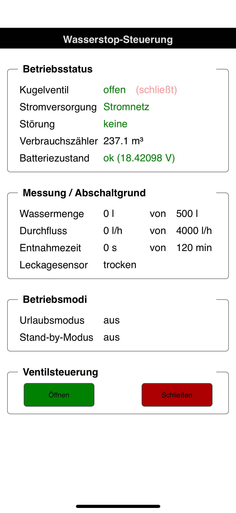

# esp8266.zewa-wasserstop-gateway

## What's this project about?
This project aims to integrate the [Judo ZEWA Wasserstop](https://judo.eu/produkt/judo-zewa-wasserstop-jzw-%C2%BE-1%C2%BC/) in smart home systems. Therefore, an ESP8266 based WeMos D1 mini serves as a gateway. Using a RS-323 to TTL converter the ESP8266 is connected to the RS-323 serial interface of the Judo ZEWA Wasserstop on one side. On the other side, it connects to a WiFi and provides several HTTP endpoints. Using REST calls these endpoints can be used to read data and control the valve of the Wasserstop remotely.

## Disclaimer
### No Warranty / No Liability Statement
Although already stated in the appended [License file](./LICENSE) let's be crystal clear: Use this software and the described hardware setup *AT YOUR OWN RISK*. Be aware, if you screw up something in your setup you may destroy the Wasserstop unit or any other part involved.

### Personal Statement
* I'm *not* associated in any kind with the vendor of the Judo ZEWA Wasserstop system, i.e. [Judo Wasseraufbereitung GmbH](https://judo.eu)
* Please do *not* contact me or any other committer of this project for sales, consulting or advice like "Where can I buy XYZ?", "Can I purchase a cable from you?", etc.

### Collaboration and Ideas are welcome
After all the DON'Ts above let's also be clear: if you have specific questions, ideas or a feature request you are highly welcome to join and contribute.

## Usage

### Setup
Please refer to section [Hardware Setup](#hardware-setup) to learn how to wire up things. Section [Development](#development) will tell you how to compile the sources and upload it to your ESP8266 board.

### First Start
Upon first start you can see a new Wifi access point. Please connect to it. You'll automatically be redirected to a captive portal. Select the Wifi and enter the access code.

### Endpoints

#### `/webapp` (GET, no parameters)
Displays a single web application (SWA). The web app is based on AJAX and perodically polls data from the /all-data endpoint (see above). On iOS this web app can be opened with Safari and an app icon can be placed on the home screen.

##### Look and feel of the webapp SWA on an iPhone:

#### `/all-data` Read operational data from Wasserstop
Returns a JSON objects containing the last valid set of data retrieved from the Wasserstop. This gateway periodically polls for the data from the Wasserstop. `/all-data` renders this data into a JSON response.

| Endpoint     	    | `/all-data`                                              	|
|-----------------	|---------------------------------------------------------	|
| HTTP method     	| `GET`                                                    	|
| Parameters      	| none                                                    	|
| Example request 	| `curl -i --request GET http://WasserstopGateway/all-data`	|
| Example response  | [Example JSON response](doc/example-all-data-response-1.json) |

#### `/ventil-auf-zu` Toggle valve in Wasserstop
Changes state of valve in Wasserstop from closed to open or vice versa. The Wasserstop will only process this command if the valve is currently *not* in motion.

| Endpoint     	    | `/ventil-auf-zu`                                         	|
|-----------------	|---------------------------------------------------------	|
| HTTP method     	| `POST`                                                    	|
| Parameters      	| none                                                    	|
| Example request 	| `curl -i --request POST http://WasserstopGateway/ventil-auf-zu`	|

#### `/ventil-zu` Close valve in Wasserstop
If the valve in the Wasserstop is opened this command with close the valve. If the valve is already closed this command has no effect. The Wasserstop will only process this command if the valve is currently *not* in motion.

| Endpoint     	    | `/ventil-zu`                                         	|
|-----------------	|---------------------------------------------------------	|
| HTTP method     	| `POST`                                                   	|
| Parameters      	| none                                                    	|
| Example request 	| `curl -i --request POST http://WasserstopGateway/ventil-zu`	|

#### `/ventil-auf` Open valve in Wasserstop
If the valve in the Wasserstop is closed this command with open the valve. If the valve is already opened this command has no effect. The Wasserstop will only process this command if the valve is currently *not* in motion.

| Endpoint     	    | `/ventil-auf`                                         	|
|-----------------	|---------------------------------------------------------	|
| HTTP method     	| `POST`                                                   	|
| Parameters      	| none                                                    	|
| Example request 	| `curl -i --request POST http://WasserstopGateway/ventil-auf`	|

#### `/set-pushover-tokens` Set the app/user token required to send push notifications via Pushover
The Wasserstop gateway supports sending push notifications via [Pushover.net](https://www.pushover.net) (commercial app, pay once).
Notifcations look like this (a custom icon needs to be configured):
 

| Endpoint     	    | `/set-pushover-tokens`                                   	|
|-----------------	|---------------------------------------------------------	|
| HTTP method     	| `POST`                                                    	|
| Parameters      	| Parameter: `app-token`: 30 Zeichen langer alphanumerischer String `user-token`: 30 Zeichen langer alphanumerischer String	|
| Example request 	| `curl -i --request POST --data '{"app-token":"alwucdbvppok4i9g7a44lnvvv3o8qo", "user-token":"v4kg1pnw7i9hbpvuqap4q96h0krxe5"}' http://192.168.178.62/set-pushover-tokens`	|

#### `/test-notification` Send test push notification
If the authentication tokens for [Pushover.net](https://www.pushover.net) have been set (-> `/set-pushover-tokens`) this endpoint can be used to trigger a test push notification.

| Endpoint     	    | `/test-notification`                                         	|
|-----------------	|---------------------------------------------------------	|
| HTTP method     	| `POST`                                                   	|
| Parameters      	| none                                                    	|
| Example request 	| `curl -i --request POST http://WasserstopGateway/test-notification`	|

#### `/set-wasserzaehler-offset` Adjust water consumption counter to external water meter
This function takes the amount of water in liters as given in die `value` field and subtracts the value of the built-in water consumption counter. The function stores the resulting difference as an offset. The offset is used to calculate the current value of the external water meter, i.d. *offset + built-in-counter = water-meter*.

| Endpoint     	    | `/set-wasserzaehler-offset`                                   	|
|-----------------	|---------------------------------------------------------	|
| HTTP method     	| `POST`                                                    	|
| Parameters      	| Parameter: `value`: Integral value larger or equal to 0, that represents the current amount of consumed water in liters (m³ x 1000)  according to an external water meter. |
| Example request 	| `curl -i --request POST --data '{"value":120435}' http://192.168.178.62/set-wasserzaehler-offset`	|

#### `/restart` Restarts the ESP8266
Use this endpoint to trigger a restart of the ESP8266.

| Endpoint     	    | `/restart`                                         	|
|-----------------	|---------------------------------------------------------	|
| HTTP method     	| `POST`                                                   	|
| Parameters      	| none                                                    	|
| Example request 	| `curl -i --request POST http://WasserstopGateway/restart`	|

## Hardware Setup
### Schematic

(Please be aware that the pin order on your RS-232 to TTL converter might be different, look at the pin labels)

### Used Parts
* RS-232 to TTL converter with MAX3232 chip that can deal with 3,3V TTL level (~2 Euro, [Aliexpress](https://de.aliexpress.com/item/33024283173.html))
* ESP-8266 (WeMos D1 mini) (~3 Euro, [Aliexpress](https://de.aliexpress.com/item/4000420770002.html))
* Do it yourself: RS-232 cable (or buy it from Judo for about 150 Euro)
  * Header connector: 3-pin MAS-CON PANCON, IDC, 3.96mm (CE156F24-3-D) (~5-10 Euro for end customers, you may be lucky on Ebay)
  * Basic old-style D-Sub 9 serial cable where you cut off one end (~4 Euro, [Amazon](https://www.amazon.de/ASSMANN-AK-610202-020-9-Pol-Stecker-Kupplung/dp/B007PO8BTQ/))

### Cable Wiring
The RS-232 to TTL converter probably has a *female* D-Sub 9 connector. Hence, you will need to plug in the *male* connector of the cable. Cut off the female connector and remove the outer part of the cable's insulation.

In the ZEWA Wasserstop unit the RS-323 pin header order is as follows:

When you've bought IDC header connectors (IDC = insulation-displacement contact) you may just use a screw driver to squeeze the litz wires into the header connector. Make sure the header connector is in the right orientation. Connect the litz wires behind the D-Sub connector pins as follows:
* Pin 2 -> RX
* Pin 3 -> TX
* Pin 5 -> GND

### Connect to Wasserstop Unit
According to [Beiblatt für RS-232-Kabel zum Judo Zewa Wasserstop](https://judo.eu/app/downloads/files/de/8140001/manuals/1701936.pdf) you first need to remove the power plug. Then you can connect your DIY gateway with the RS-232 header pins of the Wasserstop unit. Eventually, insert the unit's power plug again.

## Development

### TODOs
For the beginning all open to-dos are listed here:

#### Miscellaneous
* Soft-limits: if none of the fixed settings suits your needs a soft limit allows for choosing different trigger limits.
* Added dedicated LED that signals an established WiFi connection

#### Security
Currently none of the calls is secured. Hence, every client in the WiFi may control the Wasserstop unit. A shared key that is transferred in an HTTP header *similar* to JWT tokens may be a viable solution.

### Used Tooling
* Arduino IDE, 1.8.13, https://www.arduino.cc/en/Main/Software

### Library dependencies
| Library                                                                      	| Version                    	| Source                                         	| Used for                                                                                 	|
|------------------------------------------------------------------------------	|----------------------------	|------------------------------------------------	|------------------------------------------------------------------------------------------	|
| SoftwareSerial                                                               	| 2.8.1                      	| https://github.com/plerup/espsoftwareserial/   	| Reading and writing serial data from/to the ZEWA Wasserstop                              	|
| WiFiManager                                                                  	| 0.15.0                     	| https://github.com/tzapu/WiFiManager           	| Convenient user interface to capture and store WiFi access data and manage auto connect. 	|
| Pushover                                                                     	| master  (date: 2020-07-12) 	| https://github.com/ArduinoHannover/Pushover/   	| Sending push notifications to mobile devices                                             	|
| NTPClient                                                                    	| 3.2.0                      	| https://github.com/arduino-libraries/NTPClient 	| Retrieving the actual time in order to add human readable timestamps to responses.       	|
| ArduinoJson                                                                  	| 6.15.2                     	| https://arduinojson.org/v6/                    	| Exchanging data via HTTP REST with a client                                              	|
| Arduino core for ESP8266 WiFi chip  (ESP8266WiFi, ESP8266WebServer, WiFiUdp) 	| 2.7.1                      	| https://github.com/esp8266/Arduino             	| Basic WiFi functionality, web server for serving HTTP REST, UDP for NTP requests.        	|

### Design considerations
* For the sake of simplicity, a passive HTTP REST interface has been chosen over an active MQTT.

## Links / References
* [Beiblatt für RS-232-Kabel zum Judo Zewa Wasserstop](https://judo.eu/app/downloads/files/de/8140001/manuals/1701936.pdf)
* [Judo ZEWA Wasserstop Einbau- und Betriebsanleitung](https://www.judo-online.com/Betriebsanleitungen/DE/Leckageschutz/Art-Nr_1701862_ZEWA-WASSERSTOP.pdf)
